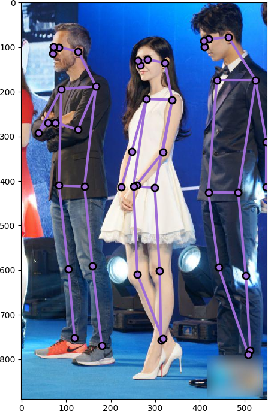

# Requirements

```
tqdm
opencv-python
easydict
pycocotools
gluoncv
mxnet
```

# Prepare for train.
Example command: 
```bash
python3 scripts/train_gluon_cpm.py --dataset-root="/data3/zyx/yks/dataset/coco2017" --gpus="7,8" --disable-fusion
```
you may want to change dataset root and gpus by yourself.


# Demo
After you have trained your own model or download the pretrained model, you can use `scripts/evaluate.py` to evaluate the model.

Example command:
```bash
PYTHONPATH=. /data2/zyx/yks/anaconda3/bin/python3 /data3/zyx/yks/mx-openpose/scripts/evaluate.py \
--resume=pretrained/resnet50-cpm-resnet-cropped-flipped_rotated-47-0.0.params \
--dataset-root="/data3/zyx/yks/dataset/coco2017" \
--gpus="0" --stage=0 --viz
```
Also, you may want to change resume, dataset root and gpus by yourself.

Example Results of our implementation:



# Results on val 2017
Our implementation(Dilated-Resnet50 as backbone, 24 epochs, 1xlr):
```bash
 Average Precision  (AP) @[ IoU=0.50:0.95 | area=   all | maxDets= 20 ] = 0.560
 Average Precision  (AP) @[ IoU=0.50      | area=   all | maxDets= 20 ] = 0.780
 Average Precision  (AP) @[ IoU=0.75      | area=   all | maxDets= 20 ] = 0.603
 Average Precision  (AP) @[ IoU=0.50:0.95 | area=medium | maxDets= 20 ] = 0.542
 Average Precision  (AP) @[ IoU=0.50:0.95 | area= large | maxDets= 20 ] = 0.597
 Average Recall     (AR) @[ IoU=0.50:0.95 | area=   all | maxDets= 20 ] = 0.598
 Average Recall     (AR) @[ IoU=0.50      | area=   all | maxDets= 20 ] = 0.800
 Average Recall     (AR) @[ IoU=0.75      | area=   all | maxDets= 20 ] = 0.636
 Average Recall     (AR) @[ IoU=0.50:0.95 | area=medium | maxDets= 20 ] = 0.551
 Average Recall     (AR) @[ IoU=0.50:0.95 | area= large | maxDets= 20 ] = 0.668
```

mAP of the original model:
```
 Average Precision  (AP) @[ IoU=0.50:0.95 | area=   all | maxDets= 20 ] = 0.590
 Average Precision  (AP) @[ IoU=0.50      | area=   all | maxDets= 20 ] = 0.810
 Average Precision  (AP) @[ IoU=0.75      | area=   all | maxDets= 20 ] = 0.643
 Average Precision  (AP) @[ IoU=0.50:0.95 | area=medium | maxDets= 20 ] = 0.575
 Average Precision  (AP) @[ IoU=0.50:0.95 | area= large | maxDets= 20 ] = 0.623
 Average Recall     (AR) @[ IoU=0.50:0.95 | area=   all | maxDets= 20 ] = 0.630
 Average Recall     (AR) @[ IoU=0.50      | area=   all | maxDets= 20 ] = 0.824
 Average Recall     (AR) @[ IoU=0.75      | area=   all | maxDets= 20 ] = 0.675
 Average Recall     (AR) @[ IoU=0.50:0.95 | area=medium | maxDets= 20 ] = 0.582
 Average Recall     (AR) @[ IoU=0.50:0.95 | area= large | maxDets= 20 ] = 0.699
```


The original pretrained model converted from Caffe can be downloaded from <https://drive.google.com/drive/folders/0BzffphMuhDDMV0RZVGhtQWlmS1U>, which is bought from [mxnet_Realtime_Multi-Person_Pose_Estimation](https://github.com/dragonfly90/mxnet_Realtime_Multi-Person_Pose_Estimation) by @dragonfly90.<br>.
